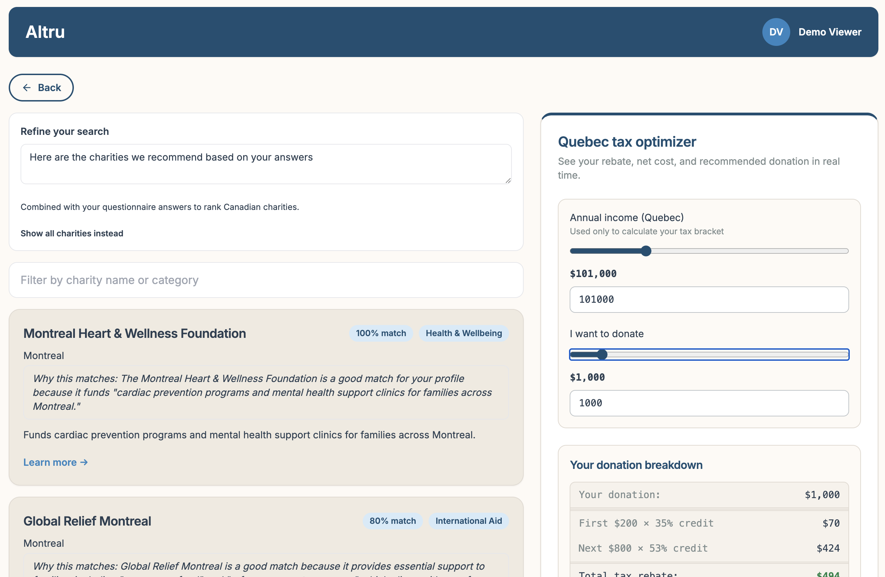

# Beaverworks

Beaverworks is the monorepo for **Altru**, a charity discovery web app aimed at Canadian donors, with emphasis on Québec and a donation tax calculator. Users sign in with demo credentials, can complete a short questionnaire, browse charity profiles, and use a filtered dashboard; search and recommendations integrate an Express API and a Botpress ADK agent (RAG over curated charity knowledge, with optional OpenAI-backed rationale). This repository holds the Vite/React frontend, the Express backend, and the ADK agent under `frontend/`, `backend/`, and `agent/` respectively.



## Running locally after clone

Requirements: **Node.js 20+** and npm. After cloning, install dependencies for all three apps in one step from the repo root:

```bash
npm run install:all
```

That runs `npm install` inside `frontend/`, then `backend/`, then `agent/` (each keeps its own `package-lock.json` under that folder).

If you do not want a root `package.json` script, the same idea in one shell line is `(cd frontend && npm install) && (cd backend && npm install) && (cd agent && npm install)`. To install only apps you care about—for example skipping `agent/` when you will not run search—you can still `cd` into those folders individually.

Charity search needs the ADK workflow running and **`OPENAI_API_KEY`** set for the agent (`adk secret:set`; details in [`agent/README.md`](agent/README.md) and [`architecture.md`](architecture.md)).

### One command: [`scripts/launch-dev.sh`](scripts/launch-dev.sh)

From the repo root, [`scripts/launch-dev.sh`](scripts/launch-dev.sh) starts backend (:3002) and frontend (:5173), opens the app in your browser, and streams logs; **Ctrl+C** stops everything. Flags (`--with-agent`, `--no-open`, `--playwright`) and port layout are documented in the script header and via:

```bash
bash scripts/launch-dev.sh --help
```

Typical flows:

```bash
bash scripts/launch-dev.sh                 # frontend + backend (no ADK)
bash scripts/launch-dev.sh --with-agent   # + Botpress ADK (bot :3000, console :3001); needs `adk` on PATH
```

For deeper walkthroughs and tests, see [docs/local-testing.md](docs/local-testing.md).

### Manual (separate terminals)

If you prefer not to use the launcher:

1. **Frontend** — proxies `/api` → backend
  ```bash
   cd frontend && npm install && npm run dev
  ```
2. **Backend**
  ```bash
   cd backend && npm install && npm run dev
  ```
3. **Agent** — needed for `/api/search`
  ```bash
   cd agent && npm install && adk dev
  ```

Optional: regenerate agent KB artifacts from the curated seed:

```bash
npx tsx scripts/ingest-charities.ts
```

More detail on ports and APIs: [architecture.md](architecture.md).