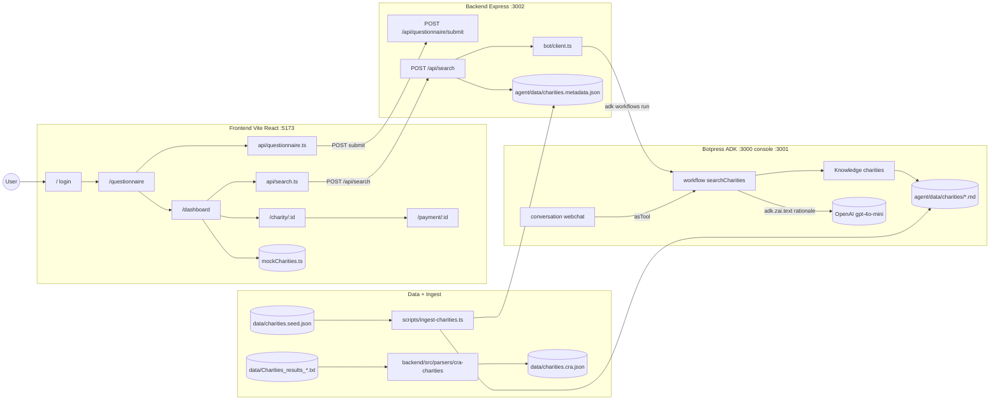

# Beaverworks — Architecture

> **SSOT for system design.** Update this file whenever any service, data flow, API contract, or component changes. See `.cursor/rules/core.mdc` for the update rule.

Last updated: 2026-05-02 (Express→agent bridge: `adk workflows run` CLI; RAG search + CRA parser; secrets via `npm run secrets:sync`; frontend Vite 8)

---

## Frontend (confirmed)

- **Framework:** Vite 8 + React 18 + TypeScript
- **Routing:** React Router v6
- **Styling:** Tailwind CSS v3 + Framer Motion
- **Testing:** Vitest + `@testing-library/react`
- **Location:** `frontend/`
- **Questionnaire API client:** `frontend/src/api/questionnaire.ts` — `POST /api/questionnaire/submit`; dev server proxies `/api` → `http://localhost:3002` (see `frontend/vite.config.ts`). Optional env: `VITE_QUESTIONNAIRE_SUBMIT_URL` for a full URL in other deploys.
- **Search API client:** `frontend/src/api/search.ts` — `POST /api/search`; same proxy. Optional env: `VITE_SEARCH_URL`.
- **Auth:** client-side only (demo), `altru_authed` in `localStorage` protects `/questionnaire`, `/dashboard`, `/charity/:id`, `/payment/:id`; `/` is login.

---

## System Overview

Altru is a charity discovery frontend with a Quebec-focused donation tax optimizer. Users sign in with demo credentials, complete (or skip) a questionnaire, browse Canadian charity data, view detail and a mock payment flow.

Two backend surfaces:

1. **Express** (`backend/`, port **3002**) — JSON API consumed by the dashboard.
  - `POST /api/questionnaire/submit` — validates and echoes the four answers (in-memory).
  - `POST /api/search` — accepts `{ answers, prompt }`, proxies to the Botpress `searchCharities` workflow via `bot/client.ts`, then hydrates the `charityId`s the workflow returns into full `CharityRecord`s using `agent/data/charities.metadata.json`.
2. **Botpress ADK agent** (`agent/`, dev bot on port **3000**, dev console on **3001**) — owns RAG.
  - `Knowledge` indexes per-charity markdown under `agent/data/charities/*.md` (generated by `scripts/ingest-charities.ts`).
  - `Workflow searchCharities` performs KB retrieval + per-result LLM rationale via `adk.zai.text` (model: `openai:gpt-4o-mini`, requires `OPENAI_API_KEY` secret).
  - `Conversation webchat` exposes the same workflow as a tool so a future webchat surface uses identical retrieval.
  - Secrets (`OPENAI_API_KEY`) are sourced from `backend/.env` via `agent/scripts/sync-secrets.ts` (`npm run secrets:sync`), which shells out to `adk secret:set`. `npm run dev` re-runs the sync before `adk dev`, so the chat/webchat surface and the workflow share the same key.

Data sources:

- **Curated seed:** `data/charities.seed.json` (8 charities, full `Charity` shape) — adapted from `frontend/src/data/mockCharities.ts`.
- **CRA TSV import (parallel track):** `backend/src/parsers/cra-charities/` converts the CRA "Charities listings" TSV export (`data/Charities_results_*.txt`, ISO-8859, 14 columns) into the same seed JSON shape; output at `data/charities.cra.json`.
- **Ingest pipeline:** `scripts/ingest-charities.ts` reads `data/charities.seed.json` and writes the agent-facing artifacts: `agent/data/charities.indexed.json`, `agent/data/charities.metadata.json`, and per-charity `agent/data/charities/<id>.md`.

The dashboard's `?mode=filtered` path calls `/api/search` with the questionnaire answers and a free-form prompt, renders `score` and `rationale` on each card, and falls back to the legacy `filterMockCharitiesByAnswers` keyword filter when the search call fails.

---

## Architecture Diagram




---

## Stack


| Layer    | Technology                                                           | Notes                                                     |
| -------- | -------------------------------------------------------------------- | --------------------------------------------------------- |
| Frontend | Vite 5, React 18, TypeScript, Tailwind v3, Framer Motion             | `frontend/` — port **5173**                               |
| Backend  | Node 20+, Express 4, TypeScript, `tsx` dev                           | `backend/` — port **3002**                                |
| Agent    | Botpress ADK (`@botpress/runtime`), TypeScript, OpenAI `gpt-4o-mini` | `agent/` — bot **3000**, console **3001**                 |
| Data     | Curated seed JSON + CRA TSV import + ingest scripts                  | `data/`, `scripts/`, `backend/src/parsers/cra-charities/` |
| Infra    | TBD                                                                  | —                                                         |
| Auth     | Demo client-side + `localStorage` flag                               | Not production auth                                       |


---

## Routes (frontend)


| Path             | Page           | Notes                          |
| ---------------- | -------------- | ------------------------------ |
| `/`              | Login          | Sets `altru_authed` on success |
| `/questionnaire` | Questionnaire  | Protected; skip → `?mode=all`  |
| `/dashboard`     | Dashboard      | `?mode=all`                    |
| `/charity/:id`   | Charity detail | Overview + financial tab       |
| `/payment/:id`   | Payment        | Mock UI only                   |


---

## API Contracts

### `POST /api/questionnaire/submit`

- **Origin:** Integrated from `[cursor/questionnaire-feature](https://github.com/parzival1l/Beaverworks/tree/cursor/questionnaire-feature)`; request shape uses Altru's `**QuestionnaireAnswers`** keys: `causes`, `beneficiaries`, `geography`, `givingStyle` (see `backend/src/types/questionnaire.ts` and `frontend/src/types/charity.ts`).
- **Request body:**

```json
{
  "answers": {
    "causes": "string",
    "beneficiaries": "string",
    "geography": "string",
    "givingStyle": "string"
  },
  "userId": "optional-string"
}
```

- **Response 200:**

```json
{
  "success": true,
  "submissionId": "uuid",
  "answers": { "…": "same as request" }
}
```

- **Errors 400:** `{ "error": "message" }` — missing/invalid `answers`, or any required key empty/non-string.

**Charity matching:** Not returned by this endpoint. Ranked recommendations come from `POST /api/search` below.

---

### `POST /api/search`

- **Source files:** `backend/src/routes/search.ts`, `backend/src/bot/client.ts`, `backend/src/types/search.ts` (mirrored at `frontend/src/types/search.ts`). Workflow input/output schemas in `agent/src/workflows/searchCharities.ts`.
- **Request body:**

```json
{
  "answers": {
    "causes": "string",
    "beneficiaries": "string",
    "geography": "string",
    "givingStyle": "string"
  },
  "prompt": "free-form user query (non-empty)",
  "userId": "optional-string"
}
```

- **Response 200:**

```json
{
  "queryId": "uuid",
  "results": [
    {
      "charity": { "id": "…", "organizationName": "…", "…": "full Charity shape" },
      "score": 0.83,
      "rationale": "1–2 sentence LLM justification"
    }
  ]
}
```

- **Errors:**
  - **400** `{ "error": "Missing or invalid answers field" }` / `Missing answers for: …` / `Missing or empty prompt field`.
  - **502** `{ "error": "searchCharities workflow failed: …" }` when the bot client throws (timeout, agent down, etc.).
- **Behaviour:** Express validates `answers` against `REQUIRED_QUESTION_IDS` and a non-empty `prompt`, then invokes the Botpress `searchCharities` workflow via `bot/client.ts` by shelling out to `adk workflows run searchCharities '<json>' --wait --format json` (cwd: `agent/`, configurable via `ADK_BIN`, `ADK_AGENT_DIR`, `ADK_TIMEOUT`). The dev agent must be running (`adk dev`, bot :3000). The workflow returns `{ queryId, results: [{ charityId, organizationName, score, rationale }] }`; Express hydrates each `charityId` into a full `CharityRecord` from `agent/data/charities.metadata.json` and returns the response. Frontend falls back to `filterMockCharitiesByAnswers` when the search request errors.

---

## Data Model

Primary UI entity: `**Charity`** and nested `**FinancialData`** — see `frontend/src/types/charity.ts`. The same shape is used by `data/charities.seed.json`, the agent metadata map (`agent/data/charities.metadata.json`), `backend/src/types/search.ts` (`CharityRecord`), and the per-charity markdown ingested by the Botpress KB.

---

## Run (local dev)

```bash
# 1. Frontend (port 5173) — Vite proxies /api -> :3002
cd frontend && npm install && npm run dev

# 2. Backend Express (port 3002)
cd backend && npm install && npm run dev

# 3. Botpress ADK agent (bot :3000, console :3001)
cd agent && npm install
adk secret:set OPENAI_API_KEY sk-...      # one-time
adk dev                                   # hot reload
adk kb sync --dev                         # after editing agent/data/charities/*.md

# 4. Ingest (regenerate agent KB artifacts from the curated seed)
npx tsx scripts/ingest-charities.ts
```

Ports are non-overlapping: frontend `5173`, Express `3002`, ADK bot `3000`, ADK console `3001`.

---

## Project Structure

```
Beaverworks/
├── agent/                          # Botpress ADK project (port 3000)
│   ├── agent.config.ts
│   ├── package.json / tsconfig.json
│   ├── README.md
│   └── src/
│       ├── conversations/webchat.ts
│       ├── knowledge/charities.ts
│       ├── types/search.ts
│       └── workflows/searchCharities.ts
├── backend/                        # Express API (port 3002)
│   ├── src/
│   │   ├── app.ts
│   │   ├── index.ts
│   │   ├── bot/client.ts
│   │   ├── data/charities.ts
│   │   ├── parsers/cra-charities/  # CRA TSV → seed JSON (ADK-shaped)
│   │   ├── routes/{questionnaire,search}.ts
│   │   └── types/{questionnaire,search}.ts
│   └── tests/
│       ├── ingest.test.ts
│       ├── parsers/cra-charities/  # 16 parser tests
│       ├── questionnaire.test.ts
│       └── search.test.ts
├── frontend/                       # Vite + React (port 5173)
│   └── src/
│       ├── api/{questionnaire,search}.ts
│       ├── components/charity/CharityCard.tsx
│       ├── components/tax/TaxOptimizer.tsx
│       ├── lib/taxCalculator.ts
│       ├── pages/{LoginPage,QuestionnairePage,DashboardPage,CharityDetailPage,PaymentPage}.tsx
│       ├── types/{charity,questionnaire,search}.ts
│       └── __tests__/
├── data/
│   ├── charities.seed.json         # 8 curated charities (full Charity shape)
│   ├── charities.cra.json          # 50 CRA-imported charities (generated)
│   └── Charities_results_*.txt     # raw CRA TSV input
├── scripts/
│   ├── ingest-charities.ts         # data/charities.seed.json → agent/data/...
│   └── test-rag-pathway.sh          # CI-ish smoke (ingest → tests → POST /api/search)
├── architecture.md
├── ACTIVITY.md
├── feature-process.md
└── docs/
    └── local-testing.md               # scripts, ports, RAG smoke + dev launch

---

## Testing

Canonical **how to run everything** (scripts, ports, flags): `[docs/local-testing.md](docs/local-testing.md)`.

```bash
# Backend (Jest + supertest)
cd backend && npm test

# Frontend (Vitest + @testing-library/react)
cd frontend && npm test

# RAG pathway smoke (ingest → focused tests → live POST /api/search on :3099 with stub bot client unless --with-agent)
bash scripts/test-rag-pathway.sh
```

All new feature behaviour follows **Red → Green → Refactor** TDD (see `.cursor/rules/core.mdc`).


| Layer    | Runner                   | Location                  |
| -------- | ------------------------ | ------------------------- |
| Backend  | Jest + supertest         | `backend/tests/`          |
| Frontend | Vitest + Testing Library | `frontend/src/__tests__/` |
| Agent    | `adk evals` (planned)    | `agent/src/**/*.eval.ts`  |


---

## Sensitive / Never-Committed Files

- `.env` / `.env.`*
- Botpress secrets (set via `adk secret:set`, never in source).
- Any credentials, tokens, or API keys (`OPENAI_API_KEY`, etc.).
- State files (e.g. `*.tfstate`).

