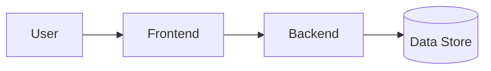

# Beaverworks — Architecture

> **SSOT for system design.** Update this file whenever any service, data flow, API contract, or component changes. See `.cursor/rules/core.mdc` for the update rule.

Last updated: 2026-05-02

---

## System Overview

_[TODO: Add a one-paragraph description of what Beaverworks does once the product scope is defined.]_

---

## Architecture Diagram

_[TODO: Replace with a Mermaid diagram once the stack is decided.]_

---

## Stack

| Layer | Technology | Notes |
|---|---|---|
| Frontend | TBD | — |
| Backend | TBD | — |
| Data | TBD | — |
| Infra | TBD | — |
| Auth | TBD | — |

---

## API Contracts

_[TODO: Document routes, request/response shapes, and auth requirements as they are built.]_

---

## Data Model

_[TODO: Document entities, keys, and relationships as they are defined.]_

---

## Testing and TDD

All new feature behaviour follows **Red → Green → Refactor** TDD (see `.cursor/rules/core.mdc`).

| Layer | Runner | Location |
|---|---|---|
| Backend | TBD (e.g. `pytest`, `jest`) | `backend/tests/` |
| Frontend | TBD (e.g. `vitest`) | `frontend/src/__tests__/` |

---

## Sensitive / Never-Committed Files

- `.env` / `.env.*`
- Any credentials, tokens, or API keys
- State files (e.g. `*.tfstate`)
