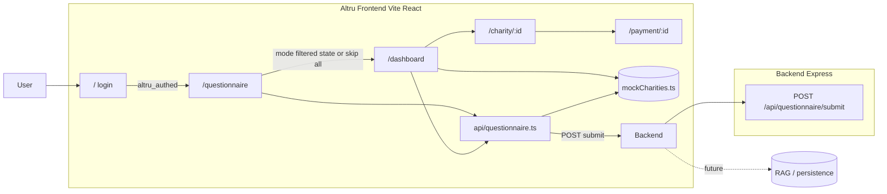

# Beaverworks — Architecture

> **SSOT for system design.** Update this file whenever any service, data flow, API contract, or component changes. See `.cursor/rules/core.mdc` for the update rule.

Last updated: 2026-05-02

---

## Frontend (confirmed)

- **Framework:** Vite 5 + React 18 + TypeScript
- **Routing:** React Router v6
- **Styling:** Tailwind CSS v3 + Framer Motion
- **Testing:** Vitest + `@testing-library/react`
- **Location:** `frontend/`
- **Questionnaire API client:** `frontend/src/api/questionnaire.ts` — `POST /api/questionnaire/submit`; dev server proxies `/api` → `http://localhost:3001` (see `frontend/vite.config.ts`). Optional env: `VITE_QUESTIONNAIRE_SUBMIT_URL` for a full URL in other deploys.
- **Auth:** client-side only (demo), `altru_authed` in `localStorage` protects `/questionnaire`, `/dashboard`, `/charity/:id`, `/payment/:id`; `/` is login

---

## System Overview

Altru is a charity discovery frontend with a Quebec-focused donation tax optimizer. Users sign in with demo credentials, complete (or skip) a questionnaire, browse Canadian charity data (mock JSON today), view detail and a mock payment flow.

The **questionnaire submit** path is integrated with a small **Express** API (ported from branch `cursor/questionnaire-feature`, adapted to Altru’s four-question schema). The API validates and stores submissions (in-memory echo only for now); the UI still derives charity recommendations by filtering `mockCharities` using the echoed answers until a RAG / LLM layer exists.

---

## Architecture Diagram



---

## Stack

| Layer | Technology | Notes |
|---|---|---|
| Frontend | Vite 5, React 18, TypeScript, Tailwind v3, Framer Motion | `frontend/` |
| Backend | Node 20+, Express 4, TypeScript, `tsx` dev | `backend/` — port **3001** default |
| Data | Mock JSON in `frontend/src/data/mockCharities.ts` | Backend does not persist questionnaires yet |
| Infra | TBD | — |
| Auth | Demo client-side + `localStorage` flag | Not production auth |

---

## Routes (frontend)

| Path | Page | Notes |
|---|---|---|
| `/` | Login | Sets `altru_authed` on success |
| `/questionnaire` | Questionnaire | Protected; skip → `?mode=all` |
| `/dashboard` | Dashboard | `?mode=all` \| `filtered`; tax optimizer sidebar |
| `/charity/:id` | Charity detail | Overview + financial tab |
| `/payment/:id` | Payment | Mock UI only |

---

## API Contracts

### `POST /api/questionnaire/submit`

- **Origin:** Integrated from [`cursor/questionnaire-feature`](https://github.com/parzival1l/Beaverworks/tree/cursor/questionnaire-feature); **request shape changed** from five generic `q1`–`q5` fields to Altru’s **`QuestionnaireAnswers`** keys: `causes`, `beneficiaries`, `geography`, `givingStyle` (see `backend/src/types/questionnaire.ts` and `frontend/src/types/charity.ts`).
- **Request body:**

```json
{
  "answers": {
    "causes": "string",
    "beneficiaries": "string",
    "geography": "string",
    "givingStyle": "string"
  },
  "userId": "optional-string"
}
```

- **Response 200:**

```json
{
  "success": true,
  "submissionId": "uuid",
  "answers": { …same as request… }
}
```

- **Errors 400:** `{ "error": "message" }` — missing/invalid `answers`, or any required key empty/non-string.

**Charity matching:** Not returned by the API yet. The frontend calls this endpoint for validation + submission id, then runs **client-side** `filterMockCharitiesByAnswers` on `mockCharities`. Replace with RAG / ranked charity IDs when the integration layer ships.

---

## Questionnaire — 5 Questions

Primary UI entity: **`Charity`** and nested **`FinancialData`** — see `frontend/src/types/charity.ts`. Same shape intended for future API responses.

---

## Run (local dev)

1. **Backend:** `cd backend && npm install && npm run dev` — listens on **3001**.
2. **Frontend:** `cd frontend && npm install && npm run dev` — Vite proxies `/api` to **3001**.

---

## Project Structure

```
Beaverworks/
├── backend/
│   ├── src/
│   │   ├── app.ts              # Express app (no listen — imported by tests)
│   │   ├── index.ts            # Server entry point (app.listen)
│   │   ├── routes/
│   │   │   └── questionnaire.ts
│   │   └── types/
│   │       └── questionnaire.ts
│   └── tests/
│       └── questionnaire.test.ts
└── frontend/
    ├── src/
    │   ├── main.tsx
    │   ├── App.tsx / App.css
    │   ├── components/
    │   │   ├── Questionnaire.tsx
    │   │   └── Questionnaire.css
    │   ├── types/
    │   │   └── questionnaire.ts
    │   └── __tests__/
    │       └── Questionnaire.test.tsx
    ├── index.html
    └── vite.config.ts
```

---

## Running Locally

```bash
# Backend (port 3001)
cd backend && npm install && npm run dev

# Frontend (port 5173)
cd frontend && npm install && npm run dev
```

---

## Testing

```bash
# Backend (Jest + supertest)
cd backend && npm test

# Frontend (Vitest + @testing-library/react)
cd frontend && npm test
```

All new feature behaviour follows **Red → Green → Refactor** TDD (see `.cursor/rules/core.mdc`).

| Layer | Runner | Location |
|---|---|---|
| Backend | Jest + supertest | `backend/tests/` |
| Frontend | Vitest + Testing Library | `frontend/src/__tests__/` |

---

## Sensitive / Never-Committed Files

- `.env` / `.env.*`
- Any credentials, tokens, or API keys
- State files (e.g. `*.tfstate`)
