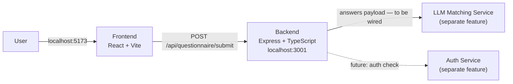

# Beaverworks — Architecture

> **SSOT for system design.** Update this file whenever any service, data flow, API contract, or component changes. See `.cursor/rules/core.mdc` for the update rule.

Last updated: 2026-05-02

---

## System Overview

Beaverworks helps users discover charities that match their personal values. Users complete a short questionnaire about their giving preferences; those answers are forwarded to an LLM-powered matching service (separate feature) that returns curated charity recommendations.

**POC scope:** localhost only. No cloud infrastructure, no persistent database.

---

## Architecture Diagram



---

## Stack

| Layer | Technology | Notes |
|---|---|---|
| Frontend | React 18 + Vite + TypeScript | Dev server: `localhost:5173`. Proxies `/api` to backend. |
| Backend | Express + TypeScript (`tsx` for dev) | API server: `localhost:3001`. |
| Auth | TBD (separate team feature) | `userId` field on questionnaire payload is reserved. |
| LLM Matching | TBD (separate team feature) | Backend route is designed to forward answers. |
| Infra | Localhost only (POC) | No cloud resources yet. |

---

## API Contracts

### `POST /api/questionnaire/submit`

Receives the user's questionnaire answers. Designed to forward them to the LLM matching service once that integration is built.

**Request body:**
```json
{
  "answers": {
    "q1": "string",
    "q2": "string",
    "q3": "string",
    "q4": "string",
    "q5": "string"
  },
  "userId": "string (optional — reserved for auth integration)"
}
```

**Success response `200`:**
```json
{
  "success": true,
  "submissionId": "uuid-v4",
  "answers": { "q1": "...", "q2": "...", "q3": "...", "q4": "...", "q5": "..." }
}
```

**Error response `400`:**
```json
{ "error": "Missing answers for: q3, q4, q5" }
```

---

## Questionnaire — 5 Questions

| ID | Question | Options |
|---|---|---|
| q1 | Which cause area resonates with you most? | Environment & Climate · Education & Youth · Health & Medical Research · Hunger & Poverty Relief · Animal Welfare |
| q2 | Where would you like your impact to be felt? | My local community · Nationally (within the US) · Internationally / globally · Wherever the need is greatest |
| q3 | How do you prefer your donation to create change? | Direct aid · Research & innovation · Advocacy & policy change · Education & awareness programs |
| q4 | What matters most when choosing a charity? | Financial transparency & low overhead · Proven track record & results · Alignment with my personal values · Endorsement by trusted sources |
| q5 | How involved would you like to be beyond donating? | Just donate — keep it simple · Volunteer opportunities · Stay informed with updates · Actively campaign or fundraise |

---

## Project Structure

```
Beaverworks/
├── backend/
│   ├── src/
│   │   ├── app.ts              # Express app (no listen — imported by tests)
│   │   ├── index.ts            # Server entry point (app.listen)
│   │   ├── routes/
│   │   │   └── questionnaire.ts
│   │   └── types/
│   │       └── questionnaire.ts
│   └── tests/
│       └── questionnaire.test.ts
└── frontend/
    ├── src/
    │   ├── main.tsx
    │   ├── App.tsx / App.css
    │   ├── components/
    │   │   ├── Questionnaire.tsx
    │   │   └── Questionnaire.css
    │   ├── types/
    │   │   └── questionnaire.ts
    │   └── __tests__/
    │       └── Questionnaire.test.tsx
    ├── index.html
    └── vite.config.ts
```

---

## Running Locally

```bash
# Backend (port 3001)
cd backend && npm install && npm run dev

# Frontend (port 5173)
cd frontend && npm install && npm run dev
```

---

## Testing

```bash
# Backend (Jest + supertest)
cd backend && npm test

# Frontend (Vitest + @testing-library/react)
cd frontend && npm test
```

All new feature behaviour follows **Red → Green → Refactor** TDD (see `.cursor/rules/core.mdc`).

---

## Sensitive / Never-Committed Files

- `.env` / `.env.*`
- Any credentials, tokens, or API keys
- State files (e.g. `*.tfstate`)
