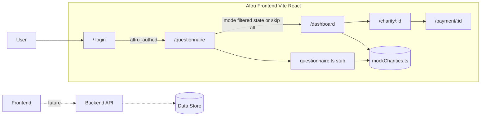

# Beaverworks — Architecture

> **SSOT for system design.** Update this file whenever any service, data flow, API contract, or component changes. See `.cursor/rules/core.mdc` for the update rule.

Last updated: 2026-05-02

---

## Frontend (confirmed)

- **Framework:** Vite 5 + React 18 + TypeScript
- **Routing:** React Router v6
- **Styling:** Tailwind CSS v3 + Framer Motion
- **Testing:** Vitest + `@testing-library/react`
- **Location:** `frontend/`
- **API contracts:** see `frontend/src/api/questionnaire.ts` for questionnaire stub shape (`POST /api/questionnaire` TBD; today: async stub filters mock charities by tag)
- **Auth:** client-side only (demo), `altru_authed` in `localStorage` protects `/questionnaire`, `/dashboard`, `/charity/:id`, `/payment/:id`; `/` is login

---

## System Overview

Altru is a charity discovery frontend with a Quebec-focused donation tax optimizer. Users sign in with demo credentials, complete (or skip) a questionnaire, browse mock Canadian charity data, view detail and a mock payment flow. Backend and live APIs are not wired yet; questionnaire and charity data use mocks until a real backend replaces the stub.

---

## Architecture Diagram

---

## Stack

| Layer | Technology | Notes |
|---|---|---|
| Frontend | Vite 5, React 18, TypeScript, Tailwind v3, Framer Motion | `frontend/` |
| Backend | TBD | — |
| Data | Mock JSON in `frontend/src/data/mockCharities.ts` | Replace with API-backed model when backend exists |
| Infra | TBD | — |
| Auth | Demo client-side + `localStorage` flag | Not production auth |

---

## Routes (frontend)

| Path | Page | Notes |
|---|---|---|
| `/` | Login | Sets `altru_authed` on success |
| `/questionnaire` | Questionnaire | Protected; skip → `?mode=all` |
| `/dashboard` | Dashboard | `?mode=all` \| `filtered`; tax optimizer sidebar |
| `/charity/:id` | Charity detail | Overview + financial tab |
| `/payment/:id` | Payment | Mock UI only |

---

## API Contracts

### Questionnaire (stub → future)

- **Today:** `getFilteredCharities(answers: QuestionnaireAnswers)` in `frontend/src/api/questionnaire.ts` — simulates latency, filters `mockCharities` by tags derived from answers.
- **Future:** `POST /api/questionnaire` with JSON body matching `QuestionnaireAnswers`; response: list of charity IDs or full `Charity[]` (to align with `frontend/src/types/charity.ts`).

No other live API calls from the frontend yet.

---

## Data Model

Primary UI entity: **`Charity`** and nested **`FinancialData`** — see `frontend/src/types/charity.ts`. Same shape intended for future API responses.

---

## Testing and TDD

All new feature behaviour follows **Red → Green → Refactor** TDD (see `.cursor/rules/core.mdc`).

| Layer | Runner | Location |
|---|---|---|
| Backend | TBD (e.g. `pytest`, `jest`) | `backend/tests/` |
| Frontend | Vitest + Testing Library | `frontend/src/__tests__/` |

---

## Sensitive / Never-Committed Files

- `.env` / `.env.*`
- Any credentials, tokens, or API keys
- State files (e.g. `*.tfstate`)
